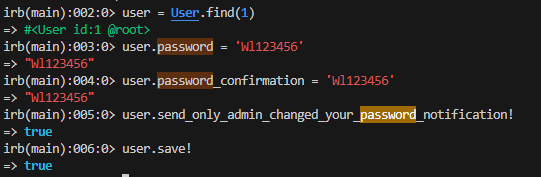

# gitlab使用总结

```bash
## 停止容器

docker stop gitlab_test

## 删除容器

docker rm gitlab_test

## 删除镜像

docker rmi gitlab/gitlab-ce:latest

## 创建容器

## 远程服务器启动容器 
dokcer run --hostname 101.37.12.36 --name gitlab_test --publish 13800:80 --publish 13822:22 --restart always  -d gitlab/gitlab-ce:latest

## 本地服务器启动容器 
dokcer run --hostname 127.0.0.1 --name gitlab_test --publish 13800:80 --publish 13822:22 --restart always  -d gitlab/gitlab-ce:latest

## 打开防火墙

firewall-cmd --zone=public --add-port=13800/tcp --permanent
firewall-cmd --zone=public --add-port=13822/tcp --permanent
firewall-cmd --reload

```

修改初始密码

```bash

# 通过Docker执行交互式Bash命令，以gitlab_test用户身份登录容器
# 这允许我们直接在GitLab容器内部进行操作，以便进行后续的密码重置操作
docker exec -it gitlab_test bash

# 启动GitLab Rails控制台，这为我们提供了一个交互式环境，
# 以便我们可以直接操作GitLab的数据库和应用程序逻辑
gitlab-rails console

# 直接在GitLab容器内启动Rails控制台
# 这提供了直接操作GitLab数据库和应用程序逻辑的交互式环境
docker exec -it gitlab_test gitlab-rails console

# 查找用户ID为1的用户，这通常代表第一个创建的用户，通常是管理员用户
# 这一步是为了定位我们要修改密码的用户对象
user = User.find(1)

# 为用户设置新密码，这里使用的是一个示例密码 'Wl123456'
# 在实际操作中，应该使用安全的密码生成策略
user.password = 'Wl123456'

# 确认新密码，这是GitLab为了确保密码输入正确而要求的步骤
# 必须再次输入新密码以进行确认
user.password_confirmation = 'Wl123456'

# 发送密码已更改的通知给用户，这确保用户知道他们的密码是被管理员更改的
# 这在某些情况下是必要的，比如为了安全原因由管理员重置用户密码
user.send_only_admin_changed_your_password_notification!

# 保存用户对象，这将把新密码和任何其他更改保存到数据库中
# 注意，这一步只有在前面的步骤都成功完成后才能执行
user.save!

```



## 使用docker-compose配置gitlab

创建一个docker-compose.yml文件，并使用`docker-compose up -d` 命令启动容器。

```yaml
# docker-compose.yml 文件
version: '3'

services:
  gitlab_test:
    image: gitlab/gitlab-ce:latest
    container_name: gitlab_test
    hostname: 127.0.0.1
    ports:
      - "13800:80"
      - "13822:22"
    volumes:
      - d:/dockerData/gitlab/config:/etc/gitlab
      - d:/dockerData/gitlab/logs:/var/log/gitlab
      - d:/dockerData/gitlab/data:/var/opt/gitlab
    restart: always
```

查看容器日志：`docker-compose logs -f gitlab_test`

停止容器： `docker-compose stop gitlab_test`


除此之外，在github上有一个国外的小伙，上传了一份[docker-gitlab](https://github.com/sameersbn/docker-gitlab),我们用这个来试下

```yaml
version: '2.3'

services:
  redis:
    restart: always
    image: redis:6.2
    command:
    - --loglevel warning
    volumes:
    - d:/dockerData/gitlab/redis-data:/data:Z

  postgresql:
    restart: always
    image: sameersbn/postgresql:14-20230628
    volumes:
    # DONE: 需要修改的配置
    - d:/dockerData/gitlab/postgresql-data:/var/lib/postgresql:Z
    environment:
    - DB_USER=gitlab
    - DB_PASS=password
    - DB_NAME=gitlabhq_production
    - DB_EXTENSION=pg_trgm,btree_gist

  gitlab:
    restart: always
    image: sameersbn/gitlab:17.2.1
    depends_on:
    - redis
    - postgresql
    ports:
    # DONE: 需要修改的配置
    - "10080:80"
    # DONE: 需要修改的配置
    - "10022:22"
    volumes:
    # DONE: 需要修改的配置
    - d:/dockerData/gitlab/gitlab-data:/home/git/data:Z
    healthcheck:
      test: ["CMD", "/usr/local/sbin/healthcheck"]
      interval: 5m
      timeout: 10s
      retries: 3
      start_period: 5m
    environment:
    - DEBUG=false

    - DB_ADAPTER=postgresql
    - DB_HOST=postgresql
    - DB_PORT=5432
    - DB_USER=gitlab
    - DB_PASS=password
    - DB_NAME=gitlabhq_production

    - REDIS_HOST=redis
    - REDIS_PORT=6379

    - TZ=Asia/Kolkata
    - GITLAB_TIMEZONE=Kolkata

    # DONE: 需要修改的配置
    - GITLAB_HTTPS=false
    - SSL_SELF_SIGNED=false

    # DONE: 需要修改的配置
    - GITLAB_HOST=localhost
    # DONE: 需要修改的配置
    - GITLAB_PORT=10080
    # DONE: 需要修改的配置
    - GITLAB_SSH_PORT=10022
    - GITLAB_RELATIVE_URL_ROOT=
    # DONE: 需要修改的配置
    - GITLAB_SECRETS_DB_KEY_BASE=long-and-random-alphanumeric-string
    # DONE: 需要修改的配置
    - GITLAB_SECRETS_SECRET_KEY_BASE=long-and-random-alphanumeric-string
    # DONE: 需要修改的配置
    - GITLAB_SECRETS_OTP_KEY_BASE=long-and-random-alphanumeric-string

    # TODO: 需要修改的配置
    - GITLAB_ROOT_PASSWORD=1392830517@qq.com
    # TODO: 需要修改的配置
    - GITLAB_ROOT_EMAIL=Wl123456

    - GITLAB_NOTIFY_ON_BROKEN_BUILDS=true
    - GITLAB_NOTIFY_PUSHER=false

    - GITLAB_EMAIL=notifications@example.com
    - GITLAB_EMAIL_REPLY_TO=noreply@example.com
    - GITLAB_INCOMING_EMAIL_ADDRESS=reply@example.com

    - GITLAB_BACKUP_SCHEDULE=daily
    - GITLAB_BACKUP_TIME=01:00

    - SMTP_ENABLED=false
    - SMTP_DOMAIN=www.example.com
    - SMTP_HOST=smtp.gmail.com
    - SMTP_PORT=587
    - SMTP_USER=mailer@example.com
    - SMTP_PASS=password
    - SMTP_STARTTLS=true
    - SMTP_AUTHENTICATION=login

    - IMAP_ENABLED=false
    - IMAP_HOST=imap.gmail.com
    - IMAP_PORT=993
    - IMAP_USER=mailer@example.com
    - IMAP_PASS=password
    - IMAP_SSL=true
    - IMAP_STARTTLS=false

    - OAUTH_ENABLED=false
    - OAUTH_AUTO_SIGN_IN_WITH_PROVIDER=
    - OAUTH_ALLOW_SSO=
    - OAUTH_BLOCK_AUTO_CREATED_USERS=true
    - OAUTH_AUTO_LINK_LDAP_USER=false
    - OAUTH_AUTO_LINK_SAML_USER=false
    - OAUTH_EXTERNAL_PROVIDERS=

    - OAUTH_CAS3_LABEL=cas3
    - OAUTH_CAS3_SERVER=
    - OAUTH_CAS3_DISABLE_SSL_VERIFICATION=false
    - OAUTH_CAS3_LOGIN_URL=/cas/login
    - OAUTH_CAS3_VALIDATE_URL=/cas/p3/serviceValidate
    - OAUTH_CAS3_LOGOUT_URL=/cas/logout

    - OAUTH_GOOGLE_API_KEY=
    - OAUTH_GOOGLE_APP_SECRET=
    - OAUTH_GOOGLE_RESTRICT_DOMAIN=

    - OAUTH_FACEBOOK_API_KEY=
    - OAUTH_FACEBOOK_APP_SECRET=

    - OAUTH_TWITTER_API_KEY=
    - OAUTH_TWITTER_APP_SECRET=

    - OAUTH_GITHUB_API_KEY=
    - OAUTH_GITHUB_APP_SECRET=
    - OAUTH_GITHUB_URL=
    - OAUTH_GITHUB_VERIFY_SSL=

    - OAUTH_GITLAB_API_KEY=
    - OAUTH_GITLAB_APP_SECRET=

    - OAUTH_BITBUCKET_API_KEY=
    - OAUTH_BITBUCKET_APP_SECRET=
    - OAUTH_BITBUCKET_URL=

    - OAUTH_SAML_ASSERTION_CONSUMER_SERVICE_URL=
    - OAUTH_SAML_IDP_CERT_FINGERPRINT=
    - OAUTH_SAML_IDP_SSO_TARGET_URL=
    - OAUTH_SAML_ISSUER=
    - OAUTH_SAML_LABEL="Our SAML Provider"
    - OAUTH_SAML_NAME_IDENTIFIER_FORMAT=urn:oasis:names:tc:SAML:2.0:nameid-format:transient
    - OAUTH_SAML_GROUPS_ATTRIBUTE=
    - OAUTH_SAML_EXTERNAL_GROUPS=
    - OAUTH_SAML_ATTRIBUTE_STATEMENTS_EMAIL=
    - OAUTH_SAML_ATTRIBUTE_STATEMENTS_NAME=
    - OAUTH_SAML_ATTRIBUTE_STATEMENTS_USERNAME=
    - OAUTH_SAML_ATTRIBUTE_STATEMENTS_FIRST_NAME=
    - OAUTH_SAML_ATTRIBUTE_STATEMENTS_LAST_NAME=

    - OAUTH_CROWD_SERVER_URL=
    - OAUTH_CROWD_APP_NAME=
    - OAUTH_CROWD_APP_PASSWORD=

    - OAUTH_AUTH0_CLIENT_ID=
    - OAUTH_AUTH0_CLIENT_SECRET=
    - OAUTH_AUTH0_DOMAIN=
    - OAUTH_AUTH0_SCOPE=

    - OAUTH_AZURE_API_KEY=
    - OAUTH_AZURE_API_SECRET=
    - OAUTH_AZURE_TENANT_ID=

volumes:
  redis-data:
  postgresql-data:
  gitlab-data:
```
