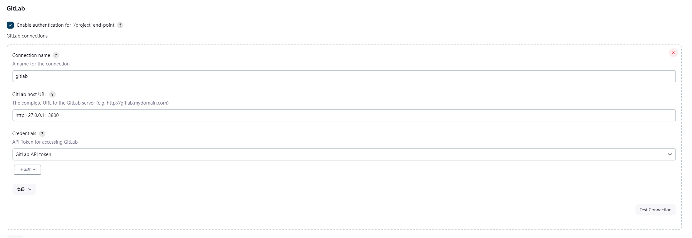

# 自动化流程配置

1. 生成ssh密钥

```bash
ssh-keygen -t rsa -b 4096 -C "1392830517@qq.com"

/c/Users/Lenovo/Downloads/ssh/deploy

passphrase： 123456

passphrase again: 123456


```

2. 配置jenkins的ssh密钥

进入jenkins，选择系统管理->凭据->全局凭据(unrestricted)->添加凭据->SSH密钥
将上面生成的deploy文件粘贴到SSH密钥中，并保存

配置gitlab插件
同时请在gitlab生成对应api token
系统管理 -> 系统配置


3. 配置gitlab的ssh密钥
进入gitlab -> 管理中心 -> 部署密钥 -> 新建密钥
将上面生成的deploy.pub文件粘贴到公钥中，并保存

创建一个test-demo的项目, 进入设置 -> 仓库 -> Deploy Keys -> 添加部署密钥 -> 启用公开访问的部署密钥，这样jenkins就可以访问并拉取test-demo的代码了

4.

复制test-demo的ssh地址，进入jenkins -> test(项目名) -> configure
